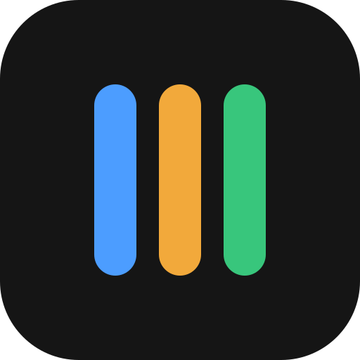

  

<h1 align="center">AgentDeck</h1>

<b>Tus agentes, en una sola vista.</b> 
Claude Code y Codex a la vez, cada chat en su hueco, su estado de un vistazo y tu uso en tiempo real.

  <a href="https://github.com/Carliny-2/agentdeck/releases/latest"><b>⬇ Descargar para Windows</b></a>
  ·
  <a href="https://agentdeck-app.netlify.app">Web</a>

---

## Instalar

1. Descarga **`AgentDeck-Setup-x.y.z.exe`** de la [última versión](https://github.com/Carliny-2/agentdeck/releases/latest).
2. Ábrelo. Si Windows dice **«Windows protegió su PC»**, pulsa **Más información › Ejecutar de todas formas**
   (el instalador aún no está firmado; es normal en el acceso anticipado).
3. AgentDeck se actualiza solo: cuando haya una versión nueva te lo dirá dentro de la app.

## Requisitos

- Windows 10 u 11 (64 bits).
- [Claude Code](https://docs.claude.com/en/docs/claude-code) o Codex instalados, con tu propia cuenta.
  AgentDeck no sustituye a los agentes: los usa tal cual.

## Privacidad

Todo se ejecuta en tu ordenador. AgentDeck no lee tus claves ni envía tus conversaciones a ningún sitio.

---

Este repositorio solo contiene las descargas. AgentDeck no está afiliado a Anthropic ni a OpenAI.
